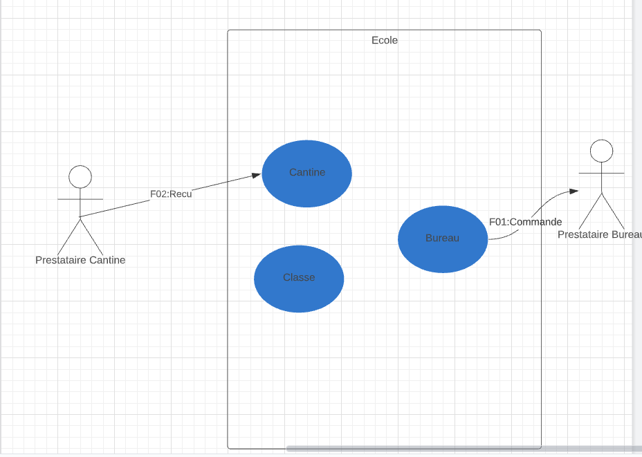
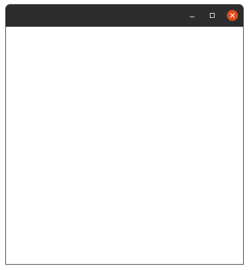
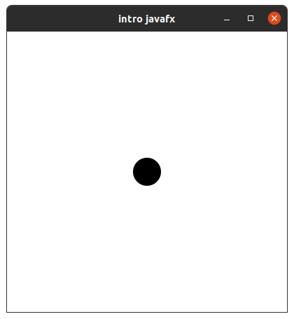
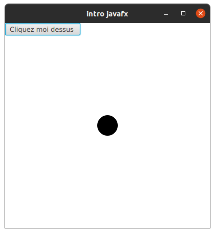
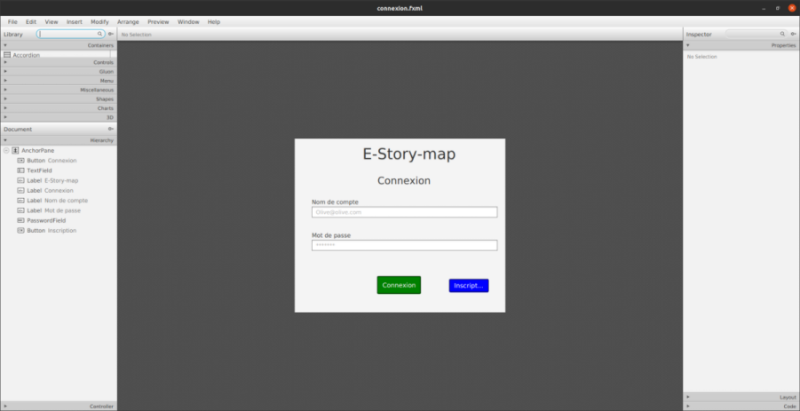
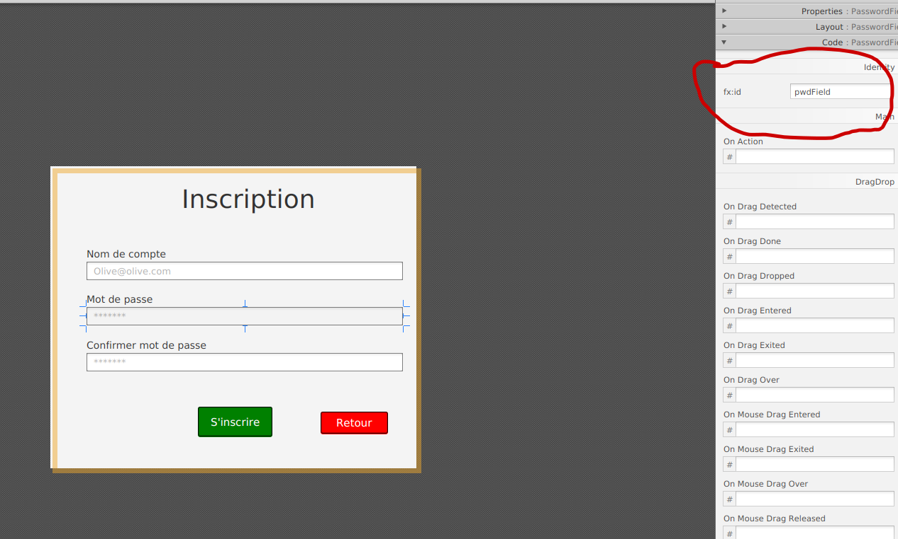

# Vert_AFSI

## Groupe

- Louis DELOFFRE
- Damia AZZOUZ
- Aya LAKEHAL
- Alpha BARRY
- Lyes ABDESSELAM

# Initialisation de JAVAFX

Depuis JAVA 11, javaFX n'est plus inclus dans le JRE de java, c'est pourquoi nous devons l'ajouter nous même.

Pour cela plusieurs étapes sont à faire :

## Pour Eclipse

- Installer e(fx)clipse :

  - Pour cela `Help -> Install New Software -> add`
    - Ajouter dans name : e(fx)clipse
    - Dans location : `http://download.eclipse.org/efxclipse/updates-released/3.0.0/site`
    - Puis sélectionner les deux packages.
  - Redémarrer eclipse une fois l'installation validée.

- Définir une librairie JAVAFX

  - Télécharger JAVAFX :

    - Pour linux :

    ```
    https://download2.gluonhq.com/openjfx/17.0.2/openjfx-17.0.2_linux-x64_bin-sdk.zip
    ```

    - Pour windows :

    ```
    https://download2.gluonhq.com/openjfx/17.0.2/openjfx-17.0.2_windows-x64_bin-sdk.zip
    ```

    - Pour macOs :

    ```
    https://download2.gluonhq.com/openjfx/17.0.2/openjfx-17.0.2_osx-aarch64_bin-sdk.zip
    ```

  - Ajouter une librairie :
    `Preferences -> Java -> Build Path -> User Libraries -> new` - Rentrer un nom à votre librairie exemple : `java-fx`
  - Une fois créée : `add external JARs -> Sélectionner les 8 JARs du dossier javafx-sdk-17.0.2/lib`

- Ajouter la librairie JAVAFX dans le build path du projet

  - `Configure Build Path -> Librairies -> Classpath -> Add Library -> User Library -> select javaFX library`

- Avant l'exécution du main
  - Rentrer dans run configuration et rentrer dans VM arguments : (le chemin vers les .JARs de javaFX)

```
--module-path "chemin vers dossier lib javafx" --add-modules javafx.controls,javafx.fxml
```

- Exécuter le programme.

# Support accepté par l'application

## MCF

- Le modèle de MCF accepté par l'application est **Lucid.app** disponible ici :

```
https://lucid.co
```

- Il faut respécter une forme particulière tel que ce modèle simple :
  

## BPMN

- Le modèle de BPMN accepté par l'application est **bpmn.io**.

```
https://bpmn.io
```

## Tutoriel d'utilisation

## Configuration serveur LDAP 

- Il vous faudra un serveur LDAP lancé en local. Nous avons utiliser Apache Directory Studio (Téléchargeable directement sur Eclipse ou ici : https://directory.apache.org/studio/)

- L'url du serveur devra être : **ldap://localhost:10389** (port par défaut d'apache)
- Il vous faudra créer un utilisateur
- Vous pourrez ensuite utiliser l'application.

## Documentation

Les différents types existants :

Stage : fenêtre principale
Scene : le contenu d'une fenêtre
Parent : un ensemble stockant des composants
Button : un bouton
Image : une image

Voir image à l'addresse suivante : https://upload.wikimedia.org/wikipedia/commons/7/7c/Javafx-stage-scene-node.jpg

Dans un premier temps on va décortiquer le main ligne par ligne :

```
// la plupart du code se passera dans le try de la fonction start

public class Main extends Application {
	@Override
	public void start(Stage primaryStage) {
		try {
			Parent root = new Parent();  // ouvre une nouvelle fenêtre
			Scene scene = new Scene(root,400,400); // création un composant de 400x400 dans la fenêtre
			scene.getStylesheets().add(getClass().getResource("application.css").toExternalForm()); // impose les normes css du fichier application css
			primaryStage.setScene(scene); // ajout de la scène de 400 pixel à la fenêtre primary stage
			primaryStage.setTitle('intro javafx') ; // ajout d'un titre
			primaryStage.show(); // affichage de la fenetre

		} catch(Exception e) {
			e.printStackTrace();
		}
	}

	public static void main(String[] args) {
		launch(args);
	}
}
```



Ajoutons une forme comme un cercle par exemple en important javafx.scen.shape:

```
root.getChildren().add( new Circle(200,200,20) ) ;


```



Ajoutons un bouton avec un evenement :

```
		try {
			Button button = new Button("Click Me");
			Parent root = new Parent();  // ouve une nouvelle fenêtre
			Circle c = new Circle(200,200,20) ;
			Button b = new Button( "Cliquez moi dessus " ) ;
	        Label l = new Label("button not selected");  // label
			EventHandler<ActionEvent> event = new  EventHandler<ActionEvent>() { // création d'evenement
	            public void handle(ActionEvent e)
	            {
	                l.setText("   button   selected    ");
	            }
	        };
	        b.setOnAction(event);
	        root.getChildren().add(b) ;
	        root.getChildren().add(l) ;
```



---

### MVC, modèle vue contrôleur ,en JavaFX


Le code en JavaFX reposera sur 3 grand axes qui sont les suivants : Model, View & Controller . Ces 3 axes permettront à l'utilisateur d'interagir avec l'application .

- 1 : View est la partie visible par l'utilisateur, front office, qui sert d'interface graphique .

- 2 : Controller contient la partie logique de l'application qui va agir en fonction des actions de l'utilisateur ( Exemple : Action quand Click sur s'inscrire, Action quand uploader un fichier par l'utilisateur, ...) .

- 3 : Model correspond aux données stockées selon un modèle précis

les 3 axes agissent entre eux de manières directes ou indirectes :

Après avoir vu sur View
L'utilisateur utilise CONTROLLER
Manipulez des données (Mettre à jour, modifier, supprimer,..), les données sur MODEL ont été changé
Affichez des données de MODEL sur VIEW

Passons maintenant à l'aspect pratique .

### Installer Scène Builder

Cette outil va nous permettre de créer des fenêtres bien plus facilement que si on devait tout coder à la main. Les fichiers produits seront sous format .fxml

- Pour linux :
  `https://gluonhq.com/products/scene-builder/thanks/?dl=https://download2.gluonhq.com/scenebuilder/17.0.0/install/linux/SceneBuilder-17.0.0.deb`
- Pour windows :
  `https://gluonhq.com/products/scene-builder/thanks/?dl=https://download2.gluonhq.com/scenebuilder/17.0.0/install/windows/SceneBuilder-17.0.0.msi`
- Pour macOs :
  `https://gluonhq.com/products/scene-builder/thanks/?dl=https://download2.gluonhq.com/scenebuilder/17.0.0/install/mac/SceneBuilder-17.0.0.dmg`

lien du site de téléchargement : `https://gluonhq.com/products/scene-builder/`

### Créer un fichier FXML sur le projet JavaFX

- Retour sur Eclipse

- File -> New -> Other -> JavaFX -> New FXML Document

- Entrer une source de dossier, le package, le nommer et choisir l'element en fonction de vos besoins, mettez par defaut AnchorPane pour le moment ( nous verrons les différentes fenêtres qu'il est possible de créer) .

- Une fois le fichier .fxml créée : Clic Droit sur le fichier -> Open with -> Others .. -> Tick external programs -> enter "Scene Builder" dans la barre -> Selectionner l'application -> OK

Scene Builder va à présent ouvrir le fichier .fxml .



Penchons nous à présent sur chaque élément et leurs attributs de ce fichier .fxml .

#### Notamment l'attribut fx:id d'une balise qui permettra d'identifier une variable en JavaFX !!

Il existe aussi l'attribut fx:value qui attribue ici logiquement une valeur



le champ de mot de passe (passwordField) a pour id JavaFX, pwdField, qui apparaitra sous cette forme :

```
<AnchorPane prefHeight="417.0" prefWidth="506.0" xmlns="http://javafx.com/javafx/17" xmlns:fx="http://javafx.com/fxml/1" fx:controller="main.java.controller.ConnexionController">
      ......
      ......
      <PasswordField fx:id="pwdField" layoutX="41.0" layoutY="243.0" prefHeight="26.0" prefWidth="446.0" promptText="*******" style="-fx-border-color: grey;" />
      <Button fx:id="inscriptionButton" layoutX="371.0" layoutY="337.0" mnemonicParsing="false" onAction="#inscription" prefHeight="20.0" prefWidth="95.0" style="-fx-background-color: blue; -fx-border-color: black; -fx-border-radius: 3;" text="Inscription" textAlignment="CENTER" textFill="WHITE">
         .....
         ......
</AnchorPane>
```

Maintenant pour l'invoquer dans un fichier Java . Il suffira de charger au préalable le fichier .fxml avant par la fonction en déclarant les variables au préalable

```
 // @FXML Here is injected component with fx:id="mainButton"
	@FXML
	private Button backButton;
	@FXML
	private Button registerButton;
	@FXML
	private TextField loginField;


Parent root = FXMLLoader.load(getClass()
		           .getResource("<chemin vers fichier fxml>"));

		  // ou encore si on veut décomposer

FXMLLoader loader = new FXMLLoader();
URL xmlUrl = getClass().getResource("/mainScene.fxml");
loader.setLocation(xmlUrl);
Parent root = loader.load();

primaryStage.setScene(new Scene(root));
primaryStage.show();


```

Cela permet de charger directement dans le root le fichier fxml et de remplir les variable du nom des même fx:id ,quand ils sont mentionnés des balise et de leur valeur .

### Java

On peut instancier un controller, pour cela il faut l'assigner au loader :

```
FXMLLoader loader = new FXMLLoader();
loader.setController(new ConnexionController());
```

### FXML

On peut specifier la classe du controller avec l'attribut fx:controller, qui a besoin d'être sur le composant root .

```

<AnchorPane xmlns="http://javafx.com/javafx"
      xmlns:fx="http://javafx.com/fxml"
      fx:controller="main.java.controller.ConnexionController">    ...
</AnchorPane >
```

Si on déclare le controller dans le fxml il est automatiquement instancier . ca a l'air plus facile mais à éviter car cela impose un controller sans argument.
on peut donc accéder au controller auto instancier:

```

FXMLLoader loader = new FXMLLoader();
loader.setLocation(getClass().getResource("/register.fxml"));
RegisterController controller = loader.getController();
```

### Appeler une méthode Controller

Maintenant que nous avons notre propre controller on peut y mettre notre réaction sur une cation comme un clickEVent par exemple :

```
public class RegisterController {

    public void buttonClicked() {
        System.out.println("Button clicked!");
    }
}
```

La prochaine étape est d'enregistrer l'appel de methode lors d'un evenement .
Pour cela on utilise l'attribut onAction= "#<methode" :

```
<VBox xmlns="http://javafx.com/javafx"
      xmlns:fx="http://javafx.com/fxml"
      fx:controller="main.java.controller.RegisterController">
    <Label fx:id="mainTitle" text="Hello world!"/>
    <Label fx:id="subTitle" text="This is a simple demo application."/>
    <Button fx:id="mainButton" text="Click me!" onAction="#buttonClicked"/></VBox>

```

et dans RegisterController.java :

```
@FXML
private void buttonClicked() {
    System.out.println("Button clicked!");
}
```

Quand nous cliquons sur le bouton, cela appellera la méthode buttonClicked() de RegisterController .buttonClicked().Cela ne marche qu'avec l'accès public de la méthode. Sinon il faut utiliser @FXML comme annotation.

```
@FXML
private void buttonClicked() {
    System.out.println("Button clicked!");
}
```

On peut integrer directement les méthodes grâce aux attributs fx:id :

```
<Button fx:id="mainButton" text="Click me!" onAction="#buttonClicked"/>
```

JavaFX tries to automatically map components with fx:id defined to fields on your controller with the same name.
JavaFx definit definit la valeur des attributs fx:id sur les champs du même nom dans le controller

Ici fx:id="mainButton" avec le champ mainButton de Register Controller

```
public class RegisterController {

    // Here is injected component with fx:id="mainButton"
    @FXML
    private Button mainButton;

}
```

Pareil avec les boutons

```
public class RegisterController {

    @FXML
    private Button mainButton;

    @FXML
    private void buttonClicked() {
        mainButton.setText("Click me again!");
    }
}

```

source : https://www.vojtechruzicka.com/javafx-fxml-scene-builder/
